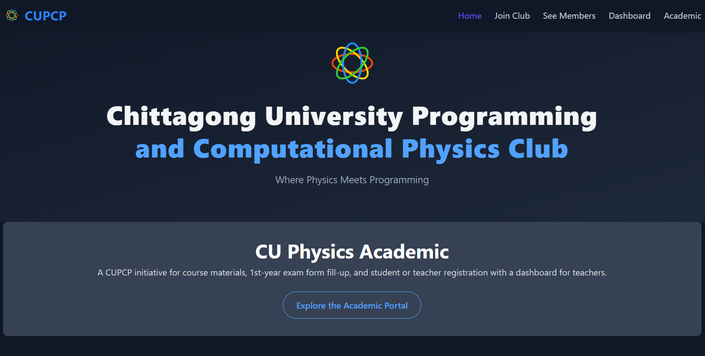
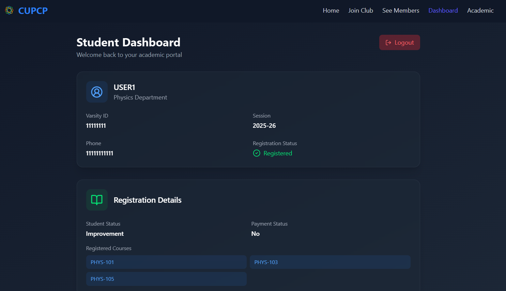
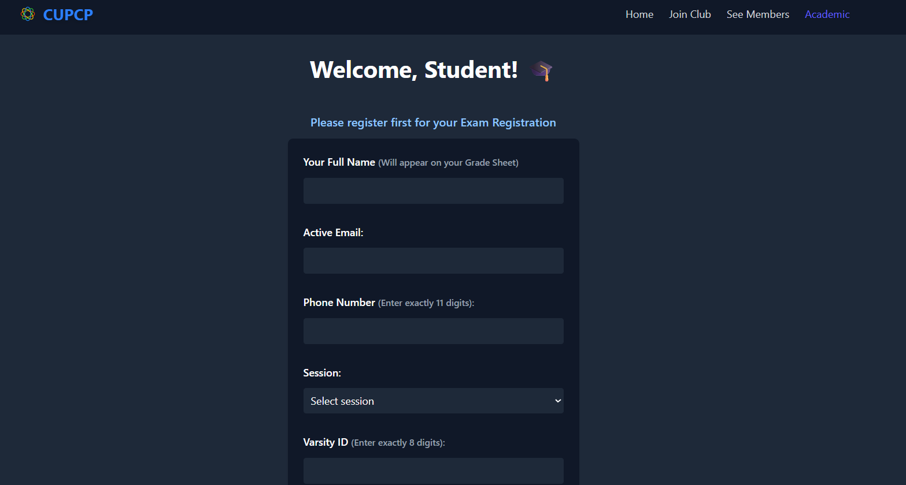
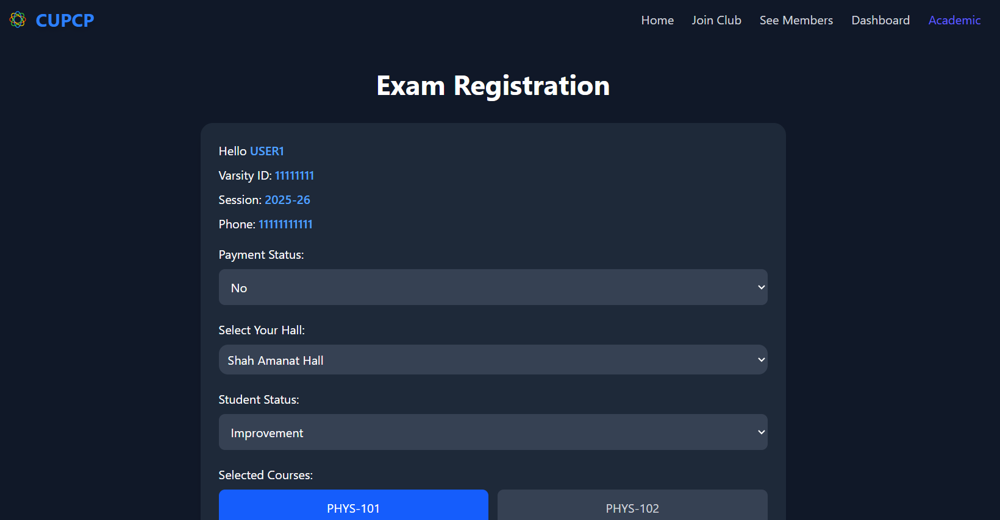
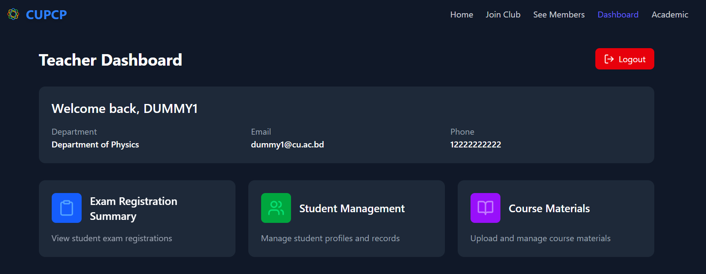
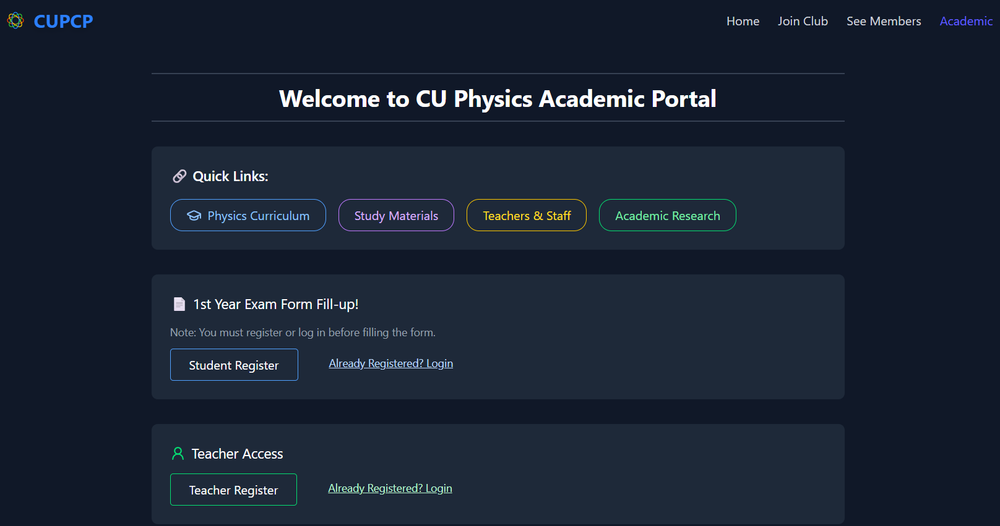
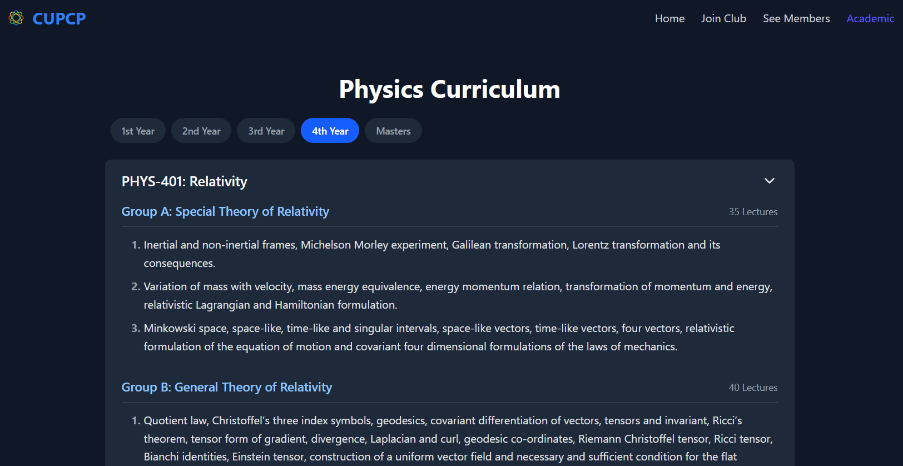

# cupcp_frontend

This is the **frontend** of the **CUPCP** full stack application, developed using **React** and **Vite** for a modern, high-performance user experience. It connects to a **Django REST API backend** and supports user authentication, student exam registration, and teacher summaries.

🔗 **Live App:** [https://cupcp.com](https://cupcp.com)  
🛠️ **Backend Repository:** [**cupcp_backend**](https://github.com/niazroky/cupcp_backend)


## ✨ Highlights

- 🏠 **Home Page:** Clean, intuitive landing experience with navigation to different pages. 
- 🧑‍🎓 **Student Dashboard:** View registered courses, track exam registration status, and manage personal profile
- 📝 **Student Registration:** Register as a new student with validation and feedback
- 📄 **Exam Registration:** Fill and submit exam forms, with confirmation screen on success
- 📚 **Academic Overview:** View available academic content such as curriculum and department info
- 🔬 **Physics Curriculum Page:** Visual display of course-specific details
- 👩‍🏫 **Teacher Dashboard:** View summary and analytics of student registrations
- 🗂️ **Teacher Registration View:** Inspect detailed records of student exam submissions and download as csv file
- 🔐 **Authentication & Authorization:**
  - JWT-based login and registration (students & teachers)
  - Auto-refresh tokens on expiry for seamless UX
  - Protected routes with session cleanup on logout


---

## 🚀 Tech Stack

- **Frontend:** React + Vite
- **Routing:** React Router
- **State Management:** React Context
- **Styling:** Tailwind CSS
- **API Communication:** Axios
- **Icons & UI Enhancements:** React Icons, conditional rendering
- **Authentication:** JWT (access & refresh tokens)

---

## 🖼️ Snapshot Pages 

### 🏠 Home Page  


### 🧑‍🎓 Student Pages  
**Dashboard**  
  
**Registration Form**  
  
**Exam Registration**  
 

### 👩‍🏫 Teacher Pages  
**Dashboard**  
  
**Exam Registration Summary**  


### 📚 Academic View  


### 🧪 Physics Curriculum  



## 📁 Frontend Project Structure

```text
cupcp_frontend/
├── dist/
├── node_modules/
├── public/
│   └── index.html
├── src/
│   ├── api/
│   │   └── apiRoute.js
│   ├── assets/
│   │   └── logo.svg
│   ├── components/
│   │   ├── Common/
│   │   │   ├── AcademicFooter.jsx
│   │   │   ├── AcademicNavbar.jsx
│   │   │   ├── Footer.jsx
│   │   │   └── Navbar.jsx
│   │   ├── CourseCurriculum/
│   │   │   ├── CourseAccordion.jsx
│   │   │   ├── RecommendedBooks.jsx
│   │   │   ├── SubsectionList.jsx
│   │   │   └── YearSelector.jsx
│   │   ├── CupcpHome/
│   │   │   ├── About.jsx
│   │   │   ├── Cards.jsx
│   │   │   └── Hero.jsx
│   │   ├── ExamRegFormHelper/
│   │   │   ├── CourseSelector.jsx
│   │   │   ├── ErrorMessage.jsx
│   │   │   ├── PaymentSelector.jsx
│   │   │   ├── StudentStatusSelector.jsx
│   │   │   ├── SubmitButton.jsx
│   │   │   └── useExamRegistration.js
│   │   ├── ExamRegSummaryHelper/
│   │   │   ├── constant.js
│   │   │   ├── DataTable.jsx
│   │   │   ├── DownloadButton.jsx
│   │   │   ├── DownloadCSV.js
│   │   │   ├── Filter.jsx
│   │   │   ├── Overview.jsx
│   │   │   └── useRegistration.jsx
│   │   ├── ProtectedRoute/
│   │   │   ├── AuthContext.jsx
│   │   │   └── PrivateRoute.jsx
│   │   └── UserRegister/
│   │       ├── StudentRegForm.jsx
│   │       └── TeacherRegForm.jsx
│   ├── data/
│   │   └── curriculum.json
│   ├── layout/
│   │   └── RootLayout.jsx
│   ├── pages/
│   │   ├── Home/
│   │   │   └── Home.jsx
│   │   ├── Academic/
│   │   │   ├── AcademicHome.jsx
│   │   │   ├── ExamRegForm.jsx
│   │   │   ├── ExamRegSummary.jsx
│   │   │   └── PhysicsCurriculum.jsx
│   │   ├── Authentication/
│   │   │   ├── Forbidden.jsx
│   │   │   ├── NotFound.jsx
│   │   │   ├── StudentLogin.jsx
│   │   │   ├── StudentRegister.jsx
│   │   │   ├── SuccessStudent.jsx
│   │   │   ├── SuccessTeacher.jsx
│   │   │   ├── TeacherLogin.jsx
│   │   │   └── TeacherRegister.jsx
│   │   ├── JoinClub/
│   │   │   └── JoinClub.jsx
│   │   └── SeeMembers/
│   │       └── SeeMembers.jsx
│   ├── App.css
│   ├── App.jsx
│   ├── index.css
│   └── main.jsx
├── .gitignore
├── db.sqlite3
├── eslint.config.js
├── package.json
├── package-lock.json
├── README.md
└── requirements.txt
```

---

## 🚀 How to Run the Project (Frontend)

Follow the steps below to run this frontend locally:

### 🔧 Prerequisites

- Node.js & npm installed
- Backend running locally (see [`cupcp_backend`](https://github.com/your-org/cupcp_backend) for setup)

---

### 1. Clone the Repository

```bash
git clone https://github.com/niazroky/cupcp_frontend.git
cd cupcp_frontend
```

### 2. Install Dependencies

Make sure you have **Node.js** and **npm** installed, then run:

```bash
npm install
```

### 3. Start the Development Server

```bash
npm run dev
```

### 4. Access the App

Once the development server starts, open your browser and go to:

```
http://localhost:5173
```

You should now see the **CUPCP Exam Registration frontend** live in your browser.

---

Thanks for checking out this project!
Feel free to reach out via email at niazroky75@gmail.com if you'd like to connect or collaborate.
